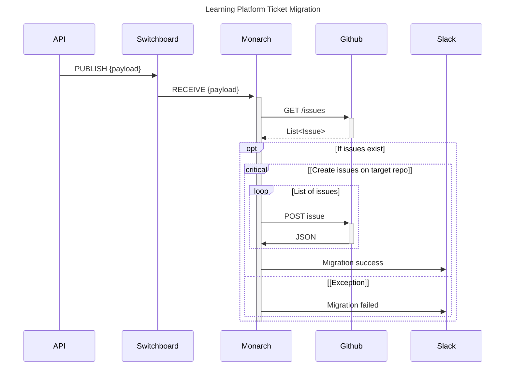

# Monarch Service

## Overview

Monarch is an independent service that is a part of the Learning Platform system that handles migrating tickets from the source group project repositories to each of the student teams' repositories. The Learning Platform API sends a message to a Valkey instance on the **channel_migrate_issue_tickets** channel after repos are created, students are added as collaborators, and Slack messages have been sent.

```py
message = json.dumps({
    'notification_channel': cohort.slack_channel,
    'source_repo': project.client_template_url,
    'all_target_repositories': issue_target_repos
})

valkey_client.publish('channel_migrate_issue_tickets', message)
```

The Monarch service listens for messages on the channel and kicks off issue ticket migration if the source repository has any, otherwise the migration process is skipped.

```py
pubsub = self.valkey_client.pubsub()
pubsub.subscribe('channel_migrate_issue_tickets')

for message in pubsub.listen():
    if message['type'] == 'message':
        data = MigrationData.model_validate_json(message['data'])
        await self.migrate_tickets(data)
```

## System Dependencies

- Python 3.10+
- [Valkey](https://valkey.io/topics/installation/)
- [valkey-py](https://github.com/valkey-io/valkey-py)
- [pipenv](https://pipenv.pypa.io/en/latest/) virtual environment manager

## Service Dependencies

- [requests](https://docs.python-requests.org/en/latest/index.html) for HTTP communication with Github and Slack
- [structlog](https://www.structlog.org/en/stable/index.html) for logging
- [pydantic](https://docs.pydantic.dev/latest/) for data validation
- [prometheus_client](https://prometheus.github.io/client_python/getting-started/three-step-demo/) for metrics
- [tenacity](https://tenacity.readthedocs.io/en/latest/) for HTTP request retrying

## Installation

1. Ensure Valkey is installed on your system.
2. Clone the repository:
    ```sh
    git clone git@github.com:stevebrownlee/service-monarch.git
    cd service-monarch
    ```

3. Install the required Python packages using `pipenv`:
    ```sh
    pipenv install
    ```

4. Start the shell for the project using `pipenv`:
    ```sh
    pipenv shell
    ```
5. Open the project with your code editor.
6. Copy the `.env.template` file as `.env`.
7. Update the `.env` file with the appropriate values as you generate them.
8. Run the service in the terminal
    ```sh
    cd monarch
    python main.py
    ```
    or start the project in debug mode in your code editor.

## Testing Locally with Valkey CLI

To test the Monarch service using `valkey-cli`, follow these steps:

1. Start the Valkey server on Mac:
    ```sh
    brew services start valkey
    ```

    On a Linux machine, I recommend that you run the Docker container.

2. Open a new terminal and connect to Valkey CLI:
    ```sh
    valkey-cli
    ```

3. Publish a test message:
    ```sh
    PUBLISH channel_migrate_issue_tickets '{ "source_repo": "nss-group-projects/cider-falls", "all_target_repositories": ["stevebrownlee/rare-test"], "notification_channel": "C06GHMZB3M3"}'
    ```

## Sequence/System Diagram



## Deployment

For a detailed description of how the Monarch service is deployed, refer to the [WORKFLOW](./WORKFLOW.md) document.

## Monitoring Production

### Monarch

For now, you can...

1. `ssh root@monarch.nss.team`
2. `cd /opt/monarch`
3. `docker compose logs -f`

This will allow you to view the logs as the service operates.

### Valkey

To enable this, modify the inbound rule on the Valkey droplet in the Terraform config file.

```tf
inbound_rule {
 protocol = "tcp"
 port_range = "6379"
 source_addresses = ["0.0.0.0/0", "::/0"]
}
```

1. `valkey-cli -h switchboard.nss.team -p 6379`
2. Once connected, run the **MONITOR** command to watch all activity.

## License
This project is licensed under the GNU GENERAL PUBLIC LICENSE.

