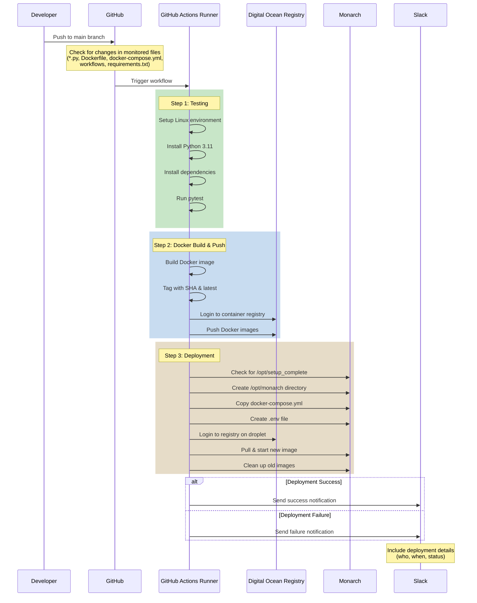

# Understanding the Monarch Service Deployment Process

This document explains how our GitHub Actions workflow automatically deploys the Monarch service when changes are pushed to the main branch.

## When Does This Run?
The workflow starts automatically when someone pushes changes to these files:
- Any Python files (`**.py`)
- The Dockerfile
- docker-compose.yml
- Any workflow files in `.github/workflows`
- requirements.txt

## The Process Step by Step

### Step 1: Running Tests

First, the workflow runs our tests:

1. Sets up a Linux environment
2. Installs Python 3.11
3. Installs all our Python dependencies
4. Runs pytest (currently set to continue even if tests fail)

### Step 2: Building and Pushing the Docker Image

After tests pass, we build and push our Docker image:

1. Builds a Docker image with our code
2. Tags it with the commit SHA and 'latest'
3. Logs into Digital Ocean's container registry
4. Pushes both versions of the image to the registry

### Step 3: Deployment

Finally, we deploy the new version:

1. Waits for the droplet to finish its initial setup. When the terraform process from the infrastructure project runs, it takes several minutes for Docker to be installed. When it is done, a file is written with `touch /opt/setup_complete`. This step waits for that file to exist.
2. Creates a directory for our app: `/opt/monarch`.
3. Copies our `docker-compose.yml` file to the droplet.
4. Creates an `.env` file with the values for the variables pulled from the Github repo's [action secrets](https://toxigon.com/github-actions-secrets).
5. Logs into the Docker registry.
6. Pulls the new image and starts it. The variables in the `.env` file makes each one an [environment variable](https://www.ceos3c.com/linux/linux-environment-variables-a-complete-guide-for-beginners/) that the service can access.
7. Cleans up old, unused images.

### Step 4: Notification

At the end, whether successful or not:

1. Sends a message to Slack about the deployment status
2. Includes details about who made the change and when

## Required Secrets

The workflow needs these secrets set up in GitHub:

- `DROPLET_HOST`: IP address of our Digital Ocean droplet
- `SSH_PRIVATE_KEY`: For accessing the droplet
- `DIGITALOCEAN_ACCESS_TOKEN`: For accessing DO services
- `DOCKER_REGISTRY`: Name of our container registry
- `DOCKER_USERNAME` and `DOCKER_PASSWORD`: For registry access
- `GH_PAT`: GitHub Personal Access Token
- `SLACK_BOT_TOKEN`: For sending messages to Slack
- `SLACK_WEBHOOK_URL`: For deployment notifications
- `VALKEY_HOST` and `VALKEY_PORT`: For connecting to Valkey service

## What's Actually Happening

1. When you push code to main, GitHub sees the changes
2. If any of the monitored files changed, this workflow starts
3. Each job runs in order: test → build → deploy
4. Each job must succeed before the next one starts
5. If any step fails, you'll get a Slack notification

The workflow ensures that:
- Code is tested before deployment
- Every deployment uses a fresh build
- The deployment process is consistent
- The team is notified of all deployments