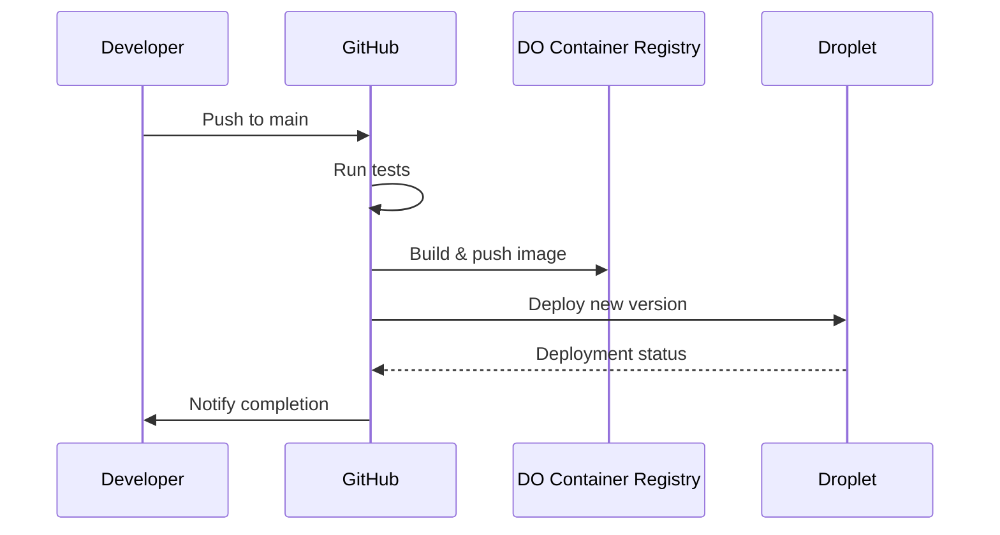

# Monarch Service Deployment

The Monarch service is automatically deployed using GitHub Actions whenever changes are pushed to the main branch.

## Workflow Trigger
The deployment workflow is triggered by pushes to the `main` branch that affect:
- Python files (`**.py`)
- `Dockerfile`
- `docker-compose.yml`
- GitHub Actions workflow files
- `requirements.txt`

## Workflow Steps

### 1. Test
- Sets up Python 3.11
- Installs dependencies from `requirements.txt`
- Runs pytest (currently set to continue on error)

### 2. Build and Push
- Builds Docker image
- Authenticates with Digital Ocean
- Pushes image to Digital Ocean Container Registry
- Tags with both latest and commit SHA

### 3. Deploy
- Creates deployment directory on droplet
- Copies `docker-compose.yml` to droplet
- Creates `.env` file with secrets
- Pulls and runs the new container
- Cleans up old images
- Sends deployment notification to Slack

## Required Secrets

* DIGITALOCEAN_ACCESS_TOKEN
* DOCKER_REGISTRY
* DOCKER_USERNAME
* DOCKER_PASSWORD
* GH_PAT
* SLACK_BOT_TOKEN
* SLACK_WEBHOOK_URL
* SSH_PRIVATE_KEY
* DROPLET_HOST
* VALKEY_HOST
* VALKEY_PORT

