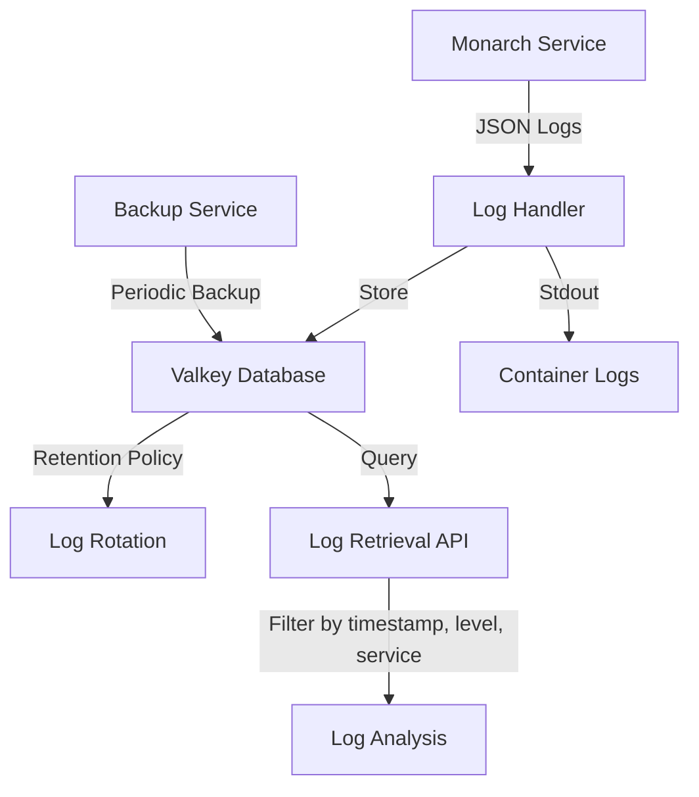
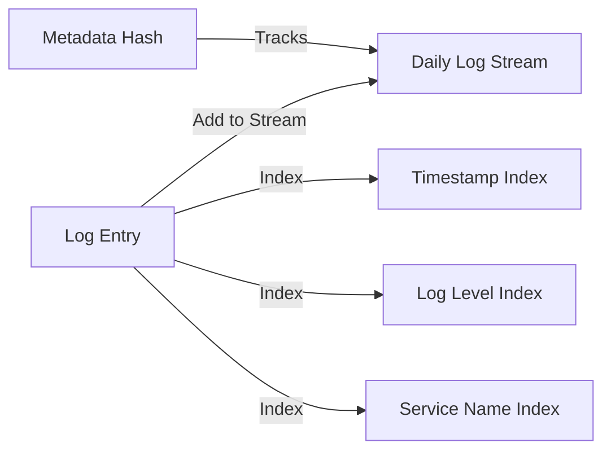
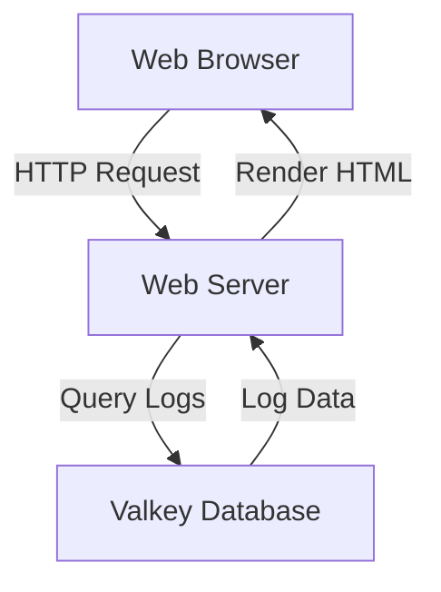

# Log Persistence Strategy for Monarch Service

## Overview

This document outlines a comprehensive log persistence strategy for the Monarch service, leveraging the existing Valkey infrastructure to store, manage, and retrieve logs efficiently.

## Requirements

- **Self-hosted solution** that integrates with existing infrastructure
- **30-day retention** for operational purposes
- **Basic filtering capabilities** by timestamp, log level, and service name
- **Low volume** handling (less than 100MB per day / few thousand entries per hour)
- **Maintain current stdout logging** while adding persistence

## Solution Architecture



### Log Storage Design

We'll use Valkey's data structures to efficiently store and retrieve logs:

- **Primary Storage**: Redis Streams - a perfect fit for time-series data like logs
- **Indexing**: Redis Sorted Sets for efficient timestamp-based queries
- **Metadata**: Redis Hashes for storing additional metadata about log streams



## Implementation Components

### 1. Log Handler

We'll create a custom log handler that:
1. Continues sending logs to stdout (maintaining current behavior)
2. Simultaneously stores logs in Valkey using the Redis Streams data structure
3. Creates appropriate indexes for efficient querying

```python
# valkey_log_handler.py
import json
import time
from datetime import datetime, timedelta

class ValkeyLogHandler:
    def __init__(self, valkey_client, retention_days=30):
        self.valkey = valkey_client
        self.retention_days = retention_days

    def handle(self, log_event):
        # Format the log entry as JSON
        log_json = json.dumps(log_event)

        # Get the current date for stream naming
        current_date = datetime.now().strftime("%Y-%m-%d")
        stream_key = f"logs:{current_date}"

        # Add to the stream
        entry_id = self.valkey.xadd(stream_key, {"data": log_json})

        # Index by timestamp, level, and service name
        timestamp = log_event.get("timestamp")
        level = log_event.get("level")
        service = "monarch"  # Can be parameterized if multiple services

        # Add to sorted sets for indexing
        if timestamp:
            self.valkey.zadd("logs:index:timestamp", {entry_id: timestamp})
        if level:
            self.valkey.zadd(f"logs:index:level:{level}", {entry_id: timestamp})
        self.valkey.zadd(f"logs:index:service:{service}", {entry_id: timestamp})

        # Update metadata
        self.valkey.hset("logs:metadata", stream_key, int(time.time()))

        # Apply retention policy
        self._apply_retention_policy()

    def _apply_retention_policy(self):
        # Get all stream keys from metadata
        all_streams = self.valkey.hgetall("logs:metadata")

        # Calculate cutoff date
        cutoff_date = datetime.now() - timedelta(days=self.retention_days)

        # Delete streams older than retention period
        for stream_key, timestamp in all_streams.items():
            stream_date = datetime.strptime(stream_key.split(":")[-1], "%Y-%m-%d")
            if stream_date < cutoff_date:
                # Delete the stream
                self.valkey.delete(stream_key)
                # Delete from metadata
                self.valkey.hdel("logs:metadata", stream_key)
                # Clean up indexes (implementation details omitted for brevity)
```

### 2. Integration with Structlog

We'll integrate our custom handler with the existing structlog configuration:

```python
# Modified structlog configuration in main.py
import structlog
from valkey_log_handler import ValkeyLogHandler

# Initialize Valkey handler
valkey_handler = ValkeyLogHandler(valkey_client)

# Configure structured logging
structlog.configure(
    processors=[
        structlog.processors.TimeStamper(fmt="iso"),
        valkey_handler.handle,  # Custom handler to store logs in Valkey
        structlog.processors.JSONRenderer()
    ]
)
logger = structlog.get_logger()
```

### 3. Log Retrieval API

We'll implement a simple API for retrieving and filtering logs:

```python
# log_retriever.py
import json

class LogRetriever:
    def __init__(self, valkey_client):
        self.valkey = valkey_client

    def get_logs_by_timerange(self, start_time, end_time, limit=100):
        # Convert times to timestamps if needed
        # Query the timestamp index
        entry_ids = self.valkey.zrangebyscore(
            "logs:index:timestamp",
            start_time,
            end_time,
            start=0,
            num=limit
        )

        # Retrieve the actual log entries
        return self._get_log_entries(entry_ids)

    def get_logs_by_level(self, level, limit=100):
        # Query the level index
        entry_ids = self.valkey.zrevrange(
            f"logs:index:level:{level}",
            0,
            limit-1
        )

        # Retrieve the actual log entries
        return self._get_log_entries(entry_ids)

    def get_logs_by_service(self, service, limit=100):
        # Query the service index
        entry_ids = self.valkey.zrevrange(
            f"logs:index:service:{service}",
            0,
            limit-1
        )

        # Retrieve the actual log entries
        return self._get_log_entries(entry_ids)

    def _get_log_entries(self, entry_ids):
        logs = []

        for entry_id in entry_ids:
            # Extract date from entry_id (format: timestamp-sequence)
            timestamp_part = entry_id.decode('utf-8').split('-')[0]
            date_str = datetime.fromtimestamp(int(timestamp_part)/1000).strftime('%Y-%m-%d')
            stream_key = f"logs:{date_str}"

            # Get the entry from the stream
            entries = self.valkey.xrange(stream_key, entry_id, entry_id)
            if entries:
                _, entry_data = entries[0]
                log_json = entry_data.get(b'data', b'{}').decode('utf-8')
                logs.append(json.loads(log_json))

        return logs
```

### 4. Web Interface for Log Access

We'll create a web interface as the primary method for accessing and analyzing logs:



We'll use Flask, a lightweight Python web framework, to create a simple web interface:

```python
# log_web_interface.py
from flask import Flask, render_template, request, jsonify
import os
import valkey
from datetime import datetime, timedelta
from log_retriever import LogRetriever

app = Flask(__name__)

# Configure Valkey connection
valkey_client = valkey.Valkey(
    host=os.getenv("VALKEY_HOST", "localhost"),
    port=int(os.getenv("VALKEY_PORT", 6379)),
    db=int(os.getenv("VALKEY_DB", 0)),
    decode_responses=False
)

log_retriever = LogRetriever(valkey_client)

@app.route('/')
def index():
    """Main page with log viewer"""
    return render_template('index.html')

@app.route('/api/logs')
def get_logs():
    """API endpoint to get logs with filtering"""
    # Get query parameters
    start_time = request.args.get('start_time', None)
    end_time = request.args.get('end_time', None)
    level = request.args.get('level', None)
    service = request.args.get('service', None)
    limit = int(request.args.get('limit', 100))

    # Convert time strings to timestamps if provided
    if start_time:
        start_time = datetime.fromisoformat(start_time).timestamp() * 1000
    else:
        # Default to 24 hours ago
        start_time = (datetime.now() - timedelta(days=1)).timestamp() * 1000

    if end_time:
        end_time = datetime.fromisoformat(end_time).timestamp() * 1000
    else:
        end_time = datetime.now().timestamp() * 1000

    # Retrieve logs based on filters
    if level:
        logs = log_retriever.get_logs_by_level(level, limit)
    elif service:
        logs = log_retriever.get_logs_by_service(service, limit)
    else:
        logs = log_retriever.get_logs_by_timerange(start_time, end_time, limit)

    return jsonify(logs)

@app.route('/api/log-levels')
def get_log_levels():
    """Get available log levels"""
    # This would need to be implemented to scan available log level keys
    # For simplicity, we'll return common levels
    return jsonify(["info", "error", "warning", "debug"])

@app.route('/api/services')
def get_services():
    """Get available services"""
    # This would need to be implemented to scan available service keys
    # For simplicity, we'll return the monarch service
    return jsonify(["monarch"])

if __name__ == '__main__':
    app.run(host='0.0.0.0', port=8081, debug=True)
```

## Integration with Main Service

To ensure the web interface starts automatically with the Monarch service, we'll integrate it directly into the main service file. This approach avoids the need for separate processes or additional orchestration.

```python
# Add to main.py
import threading
from log_web_interface import app as flask_app

def start_web_interface():
    """Start the Flask web interface in a separate thread"""
    flask_app.run(host='0.0.0.0', port=8081, threaded=True)

# In the main function or service startup
def run():
    # Start Prometheus metrics server
    start_http_server(self.settings.PROMETHEUS_PORT)

    # Start the web interface in a background thread
    web_thread = threading.Thread(target=start_web_interface, daemon=True)
    web_thread.start()

    # Continue with existing service logic
    pubsub = self.valkey_client.pubsub()
    # ...rest of the existing code
```

This approach:
1. Imports the Flask app from the log_web_interface module
2. Creates a function to start the Flask app
3. Launches the web interface in a daemon thread during service startup
4. Allows both the main service and web interface to share the same Valkey connection

The daemon thread ensures that when the main service exits, the web interface thread will also exit automatically.

## Log Rotation and Retention

The solution includes automatic log rotation and retention:

- **Daily Rotation**: Logs are stored in daily streams (e.g., `logs:2025-04-02`)
- **30-Day Retention**: Automated cleanup of streams older than 30 days
- **Metadata Tracking**: A metadata hash keeps track of all log streams for efficient management

## Backup Strategy

To ensure log durability:

1. Configure Valkey with appropriate persistence settings:
   ```
   # Add to Valkey configuration
   appendonly yes
   appendfsync everysec
   ```

2. Implement periodic RDB snapshots:
   ```
   # Add to Valkey configuration
   save 900 1
   save 300 10
   save 60 10000
   ```

3. Consider setting up Valkey replication for high availability

## Monitoring and Alerting

To ensure the logging system itself is healthy:

1. Monitor Valkey memory usage
2. Set up alerts for log storage failures
3. Periodically verify log retention policy execution

## Implementation Steps

1. Create the `valkey_log_handler.py` module with the ValkeyLogHandler class
2. Modify the structlog configuration in `main.py` to use the custom handler
3. Implement the LogRetriever class for log querying
4. Create the `log_web_interface.py` file with the Flask application
5. Create the `templates` directory and add the `index.html` template
6. Integrate the web interface with the main service using threading
7. Update the Docker configuration to expose the web interface port
8. Set up monitoring for the logging system

## Considerations and Trade-offs

- **Memory Usage**: Redis/Valkey is primarily an in-memory database, so we need to ensure sufficient memory for 30 days of logs
- **Persistence**: Configure appropriate persistence settings to prevent log loss
- **Scaling**: For future growth, consider sharding logs across multiple Valkey instances
- **Query Performance**: The indexing strategy optimizes for the specific query patterns mentioned

## Future Enhancements

- Advanced analytics and visualization features for the web interface
- Integration with alerting systems
- Expanded query capabilities
- Dashboard for log statistics and trends
